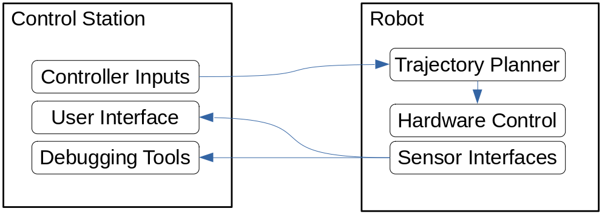
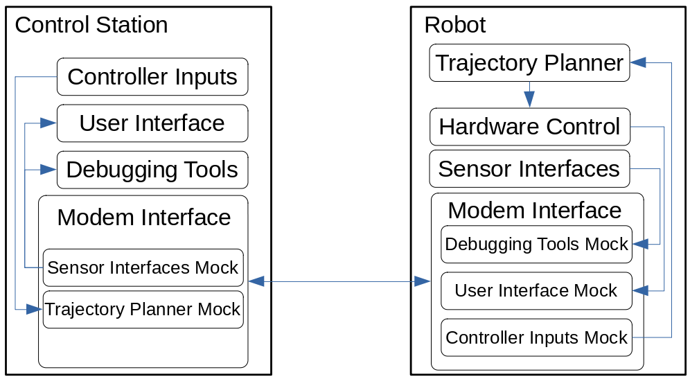

# ROSModem: Simplify the integration of modems and wireless devices in ROS

This package aims to standardize and simplify the integration of various
(non-ros, non-wifi) communications strategies into a ROS ecosystem. This is
done by providing a common interface (the 'Modem' class) which can be extended.
The user the implements the `read` and `write` functions, and the `Modem` class
will handle pulling in ROS topics, sending them across your modem, and making
them available on the other end. While we're at it, we'll handle some
compression and serialization.

## How it works/what it does

A typical robot-to-control-station interface might look something like this:

This works in many cases. However, what about when we want to send this communication over an acoustic modem, radio device, or even just a new network inteface? The typical approach is to drop ROS in favor of sending custom commands, and then having a new ROS system on the other end receive and interpret them. While this also works, it has key drawbacks:

1) Our demo/test case is potentially no longer the same as our deployment case
2) Half of our architecture is now opaque to ROS
3) Developers now need to create and maintain another set of interfaces.

Each of these present problems with development, debugging, and deployment.
A better solution is therefore to have them modem pass-through messages,
and replicate the topics on each end:

While we're at it, this is also an opportunity to handle more effective compression, etc.

## Usage

More comprehensive usage intstruction TODO.

## Evaluation

Evaluation TODO.
